## Project description & motivation
The goal of this project is to develop a machine learning model that uses real estate listing data to predict Berlin apartment rent prices (Kaltmiete).
Kaltmiete was chosen as the goal variable to ensure an accurate dataset because Warmmiete (rent including utilities) is not always available across listings.
The information was gathered by collecting publicly accessible listings from Immowelt, a significant German real estate marketplace. This source was chosen because it provides a large number of listings and rich property features such as apartment size, number of rooms, amenities, and building characteristics.
The data collected makes it possible to create and evaluate machine learning models that predict rental costs based on property characteristics.

## Key Highlights / Results
### Dataset
•	Total scraped listings: 22687  
•	Listings after cleaning: 15601  
•	Data source: Immowelt  
•	Scraping period: 28/12/2025 – 31/01/2026  
•	Number of raw features collected: 29  
•	Number of final model features: 22  
•	Missing data handled using: Median  
•	Duplicate listings removed: Yes – similarity method  
### Feature Engineering
•	Categorical encoding methods: ONE HOT ENCODING  
•	Numerical preprocessing: STANDARD SCALING  
•	Final training dataset shape: (15601, 93)   
### Exploratory Data Analysis (EDA) - Key findings from exploratory analysis:
•	Rent distribution is RIGHT-SKEWED  
•	Strong correlation between apartment size (sqm) and rent price  
•	Features with the highest correlation to rent:  
o	area of apartment m2  
o	number of rooms  
o	year of construction  
•	Amenities such as BALCONY / ELEVATOR / PARKING tend to increase rent prices. 
### Machine Learning Models
The following regression models were implemented and compared:  
•	Linear Regression  
•	Ridge Regression  
•	KNeighborsRegressor  
•	Support Vector Regressor  
•	Random Forest Regressor  
•	Gradient Boosting  
•	XGBoost  
•	Neural Network  
Training strategy:  
•	Cross-validation: 5-FOLD  
•	Hyperparameter tuning: GRID SEARCH  
### Model Performance of 5 best models
Evaluation metrics used:  
•	RMSE (Root Mean Squared Error)  
•	R² Score  

| Model | RMSE | R² |
|------|------|------|
| XGBoost | 190.97 | 0.9323 |
| Random Forest | 214.55 | 0.9146 |
| Neural Network | 222.38 | 0.9082 |
| SVR | 312.89 | 0.8184 |
| Ridge Regression | 334.63 | 0.7923 |

### Model Interpretation
Feature importance analysis shows that the most influential predictors of rent price are:
1.	Apartment size (sqm)
2.	Number of rooms
3.	If the moving time is not determined
4.	Year built
5.	Type of floor
6.	Being in the district ‘Mitte’
Model explainability methods used:
•	Feature importance from tree-based models
•	SHAP value analysis
•	Partial dependence plots

### Some insights derived from the analysis:
•	Rent prices increase approximately 15.23 €  per additional square meter.  
•	Apartments with additional features show higher average rent, especially those with features elevator, parking and built-in kitchen.  
•	Newer buildings tend to command higher rental prices.  
•	Certain districts such as Nikolassee, Grünau, Mitte, Bohnsdorf and Siemensstadt have significantly higher rent levels.  
•	If we consider the prices per square meter, we have a different ranking with Oberschöneweide on top followed by Blankenburg, Mitte, Dahlem and Friedenau. Only Mitte is the one being on both rankings.  
•	During the Cold War there was a significant higher number of constructions in West Berlin compared to East Berlin.  
•	There is not a significant difference between prices in West Berlin and East Berlin, with just West Berlin having slightly higher prices, but when we consider the prices per square meter East Berlin actually overtakes the West.  
•	If split into 4 parts, the west of Berlin is the most expensive part, followed by the south and with north and east being significantly cheaper.  
•	If split into 3 or 4 parts according to the distance from the city center, the areas in the city center tend to be more expensive, but the surrounding areas tend to be less expensive than the suburban areas, this could be due to noise.  

### Example Prediction
Apartment features:  
•	Size: 83.3 m²  
•	Rooms: 4  
•	Floor: 1  
•	Availability: immediately  
•	District: Friedrichsfelde, Berlin  
•	Amenities: built-in kitchen, bathtub, shower  
•	Balcony: Yes  
•	Terrace: No  
•	Garden: No  
•	Parking: No  
•	Basement: No  
•	Elevator: Yes  
•	Barrier-free access: Yes  
•	Flooring type: Unknown  
•	Energy source: District Heating  
•	Heating type: Underfloor Heating  
•	Property condition: New / First Occupancy  
•	Year built: 2025  
Prediction:  
•	Predicted cold rent: 1,922.72 €  
•	Actual rent: 1,990 €  
•	Prediction error: 67.28 €  

### Visual Highlights  
The repository includes visualizations such as:  
•	Rent price distribution histogram  
•	Price vs apartment size and number of rooms scatter plot  
•	Comparison of different parts of Berlin  
•	Correlation heatmap of features  
•	Feature importance ranking  
•	SHAP summary plot  

  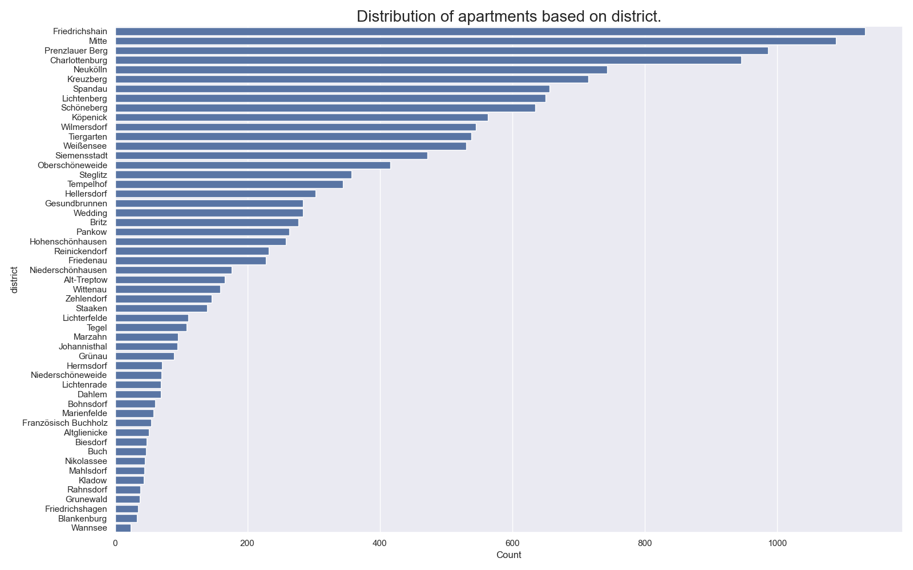
  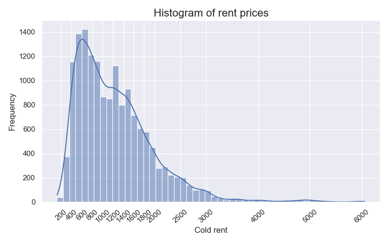

 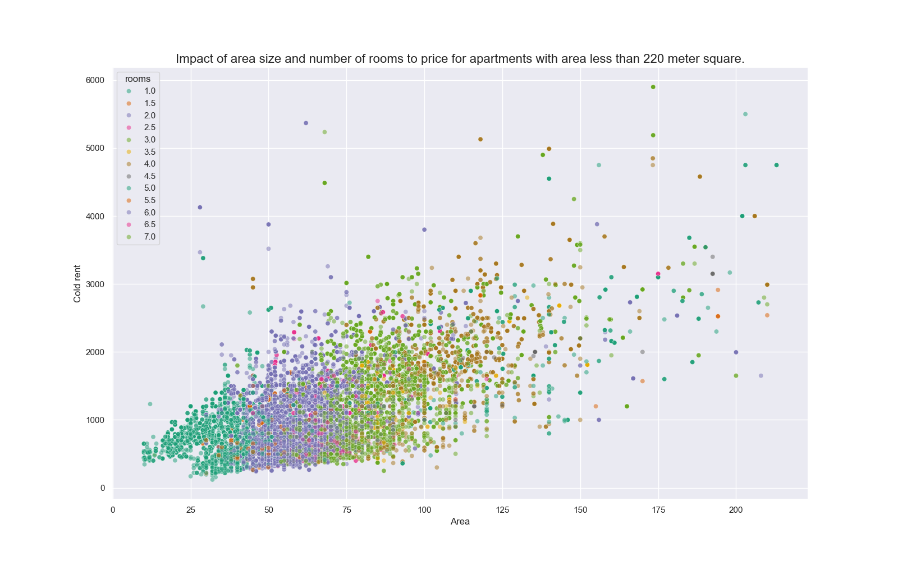 

  
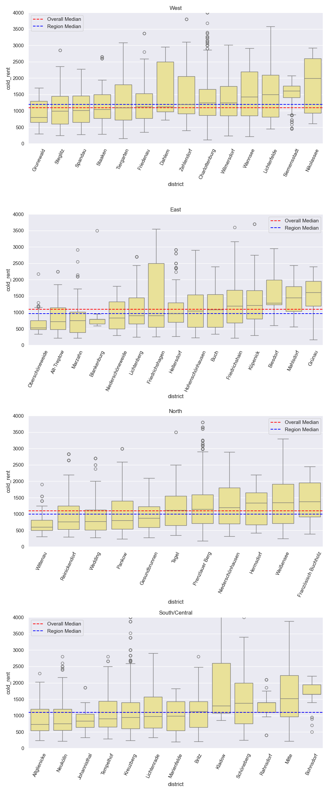
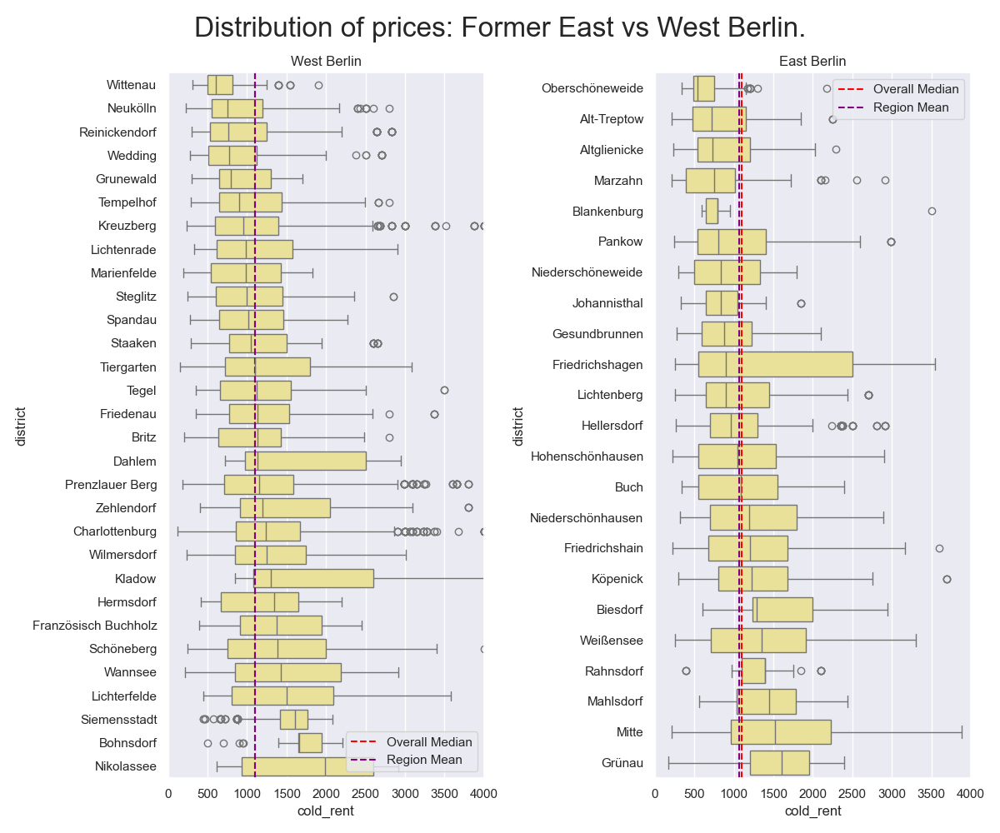
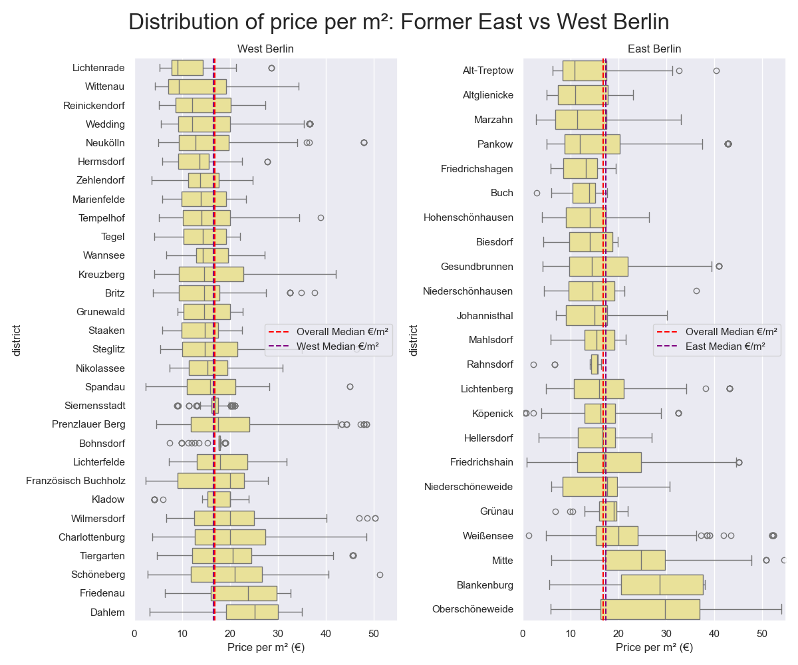
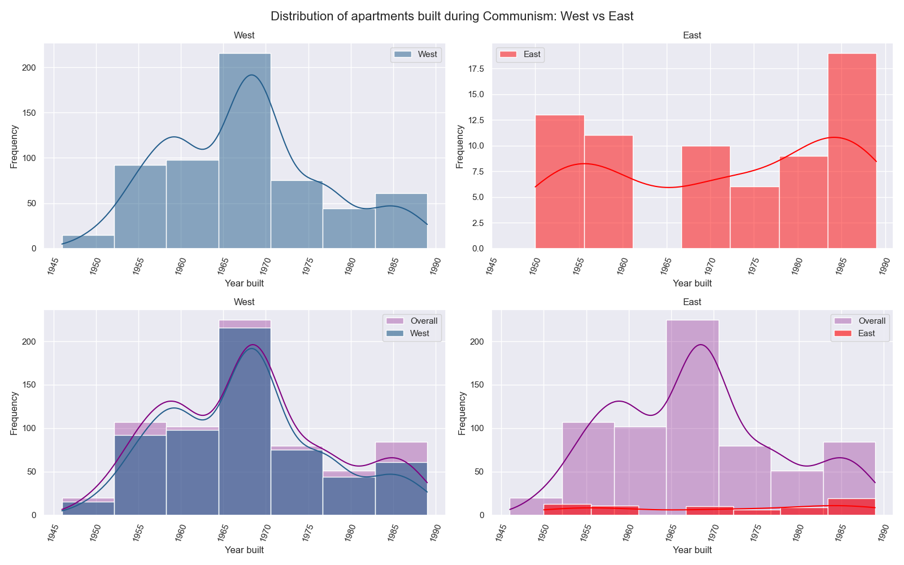
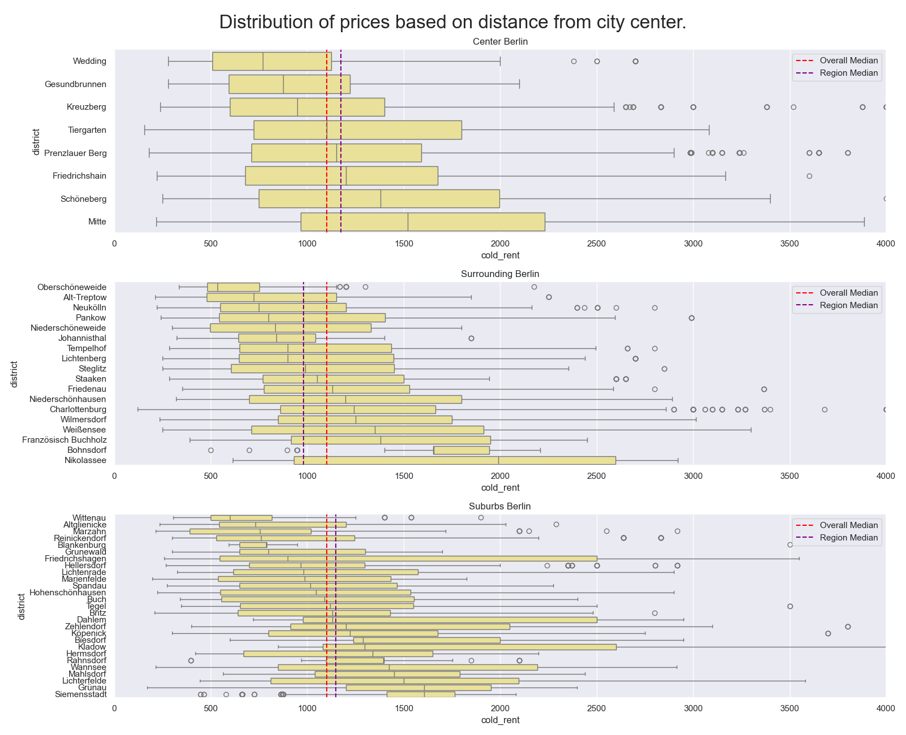
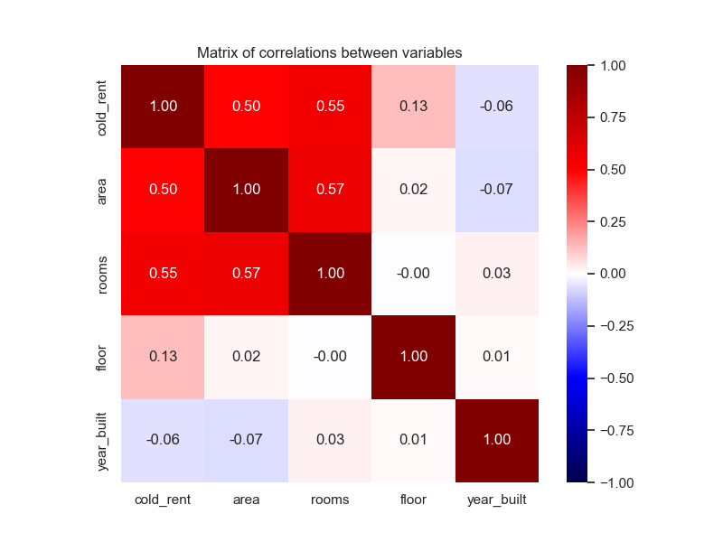
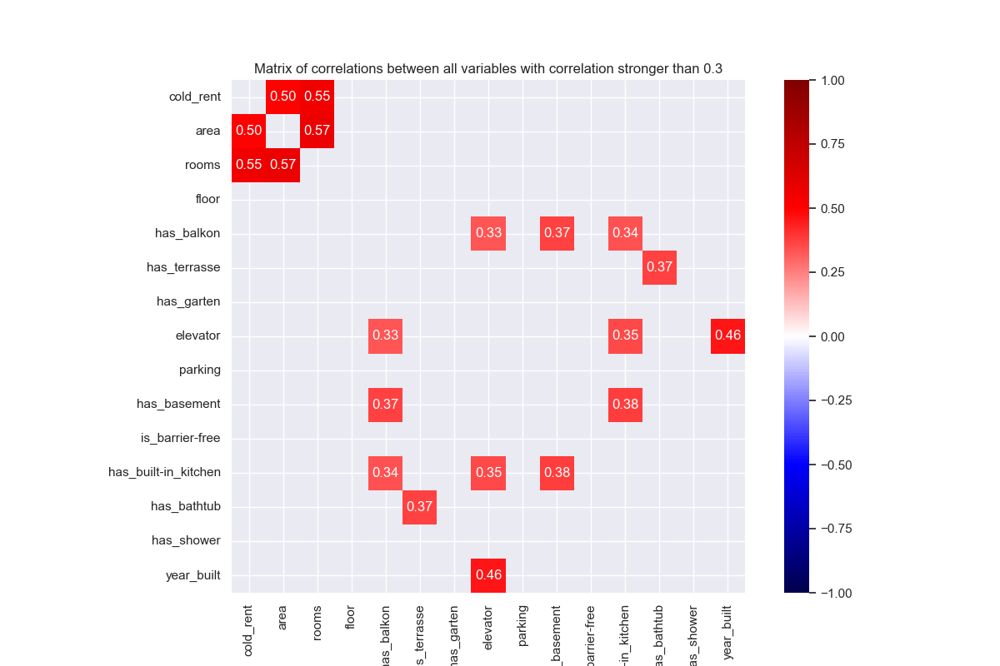
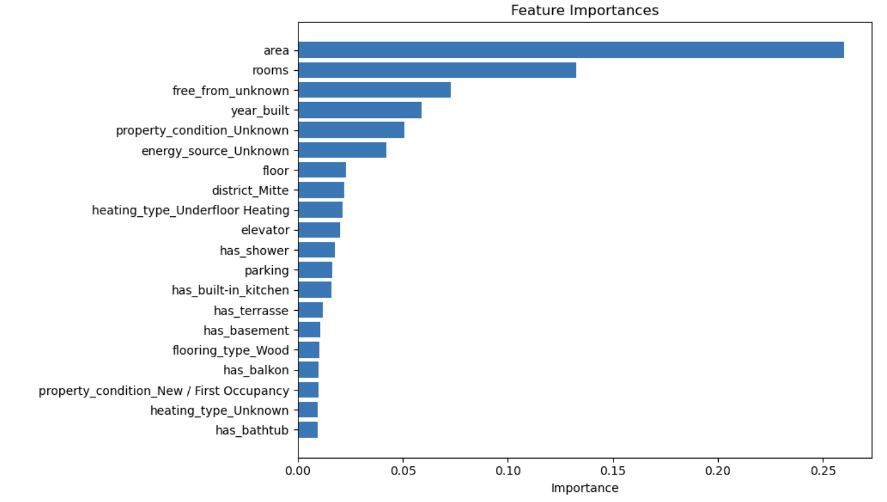
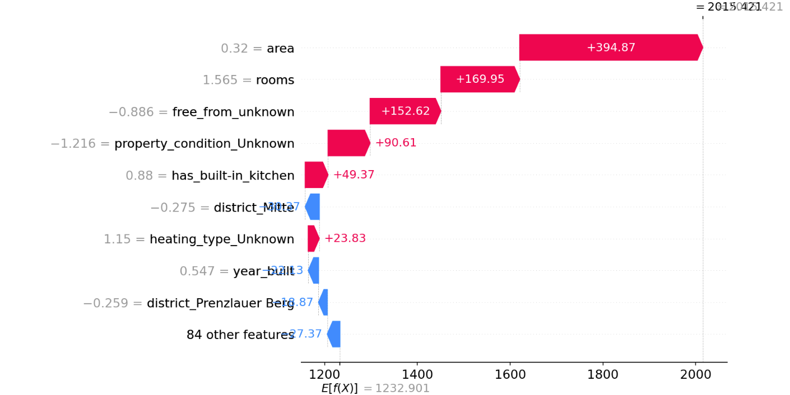

## Legal & ethical considerations
Since the website doesn’t provide any APIs to access the data, it was necessary to write a script to scrape the data. While writing the script every aspect of legal considerations in Germany, such as GDPR, was considered. Personal data like the phone number and other data of the person or the company who posted the listing weren’t scraped. These data are sensitive and aren’t needed for the model. A derived variable, such as whether the poster is the owner or a real estate agency might have had some correlation with the price, but it would require sensitive data, and it is also hard to determine. 
The scraped data is publicly available, and this project has no commercial application, but rather serves as a personal project only for learning and demonstration purposes. 
Content protected by copyright like articles and images were not scraped. 
Security bypassing mechanisms and other harmful and forbidden mechanisms were not implemented.
- The link that we used is “https://www.immowelt.de/classified-search?distributionTypes=Rent&estateTypes=House,Apartment&locations=AD08DE8634&page={pageNumber}”, which according to the robots.txt file we are allowed to access this link via web scrapers.
- Also to be respectful and not to flood the website with traffic, commands like time.sleep() were used to slow down the scraping script.

## Data collection
When it comes to the number of samples that we are going to scrape for a regression task, I would suggest at least 20,000 samples as a sufficient amount to collect, considering that we might lose up to 40% of our dataset during data preparation, so 12,000 samples would be enough to build a decent model.
But since Berlin is a very large city, I would aim for at least 25,000 scrapes.
The script scrapes the following data:
1.	Listing URL – string (unique identifier for each listing)
2.	Cold rent (Kaltmiete) – continuous (string, numeric value embedded, requires parsing)
3.	Warm rent (Warmmiete) – continuous (string, numeric value embedded, may be missing)
4.	Deposit (Kaution) – continuous (string, numeric value embedded)
5.	Area – continuous (string, square meters, requires parsing)
6.	Number of rooms – continuous (string, requires parsing)
7.	Floor – categorical (string, e.g., “3. OG”, “EG”, “DG”)
8.	Free from – temporal (string, requires formatting to date or category)
9.	Location / Address – string
10.	Has balcony – boolean
11.	Has terrace – Boolean
12.	Has garden – boolean
13.	Has elevator – boolean
14.	Has parking – boolean
15.	Has cellar (Keller) – boolean
16.	Barrier-free access – Boolean
17.	Has fitted kitchen (Einbauküche) – boolean
18.	Has bathtub – boolean
19.	Has shower – boolean
20.	Flooring type – categorical (string)
21.	Energy source – categorical (string)
22.	Heating type – categorical (string)
23.	Property condition – categorical (string)
24.	Year built – continuous (string, integer year)
25.	Energy certificate – categorical (string)
26.	Energy demand – continuous (string, e.g., “x kWh/m²a”)
27.	Schufa check required – boolean
28.	Number of images posted – discrete (string, integer)
29.	Scraped at – datetime (string, timestamp)
